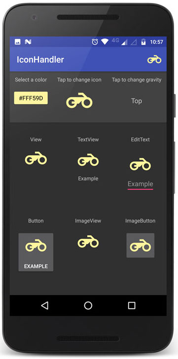
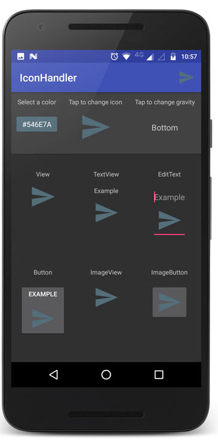
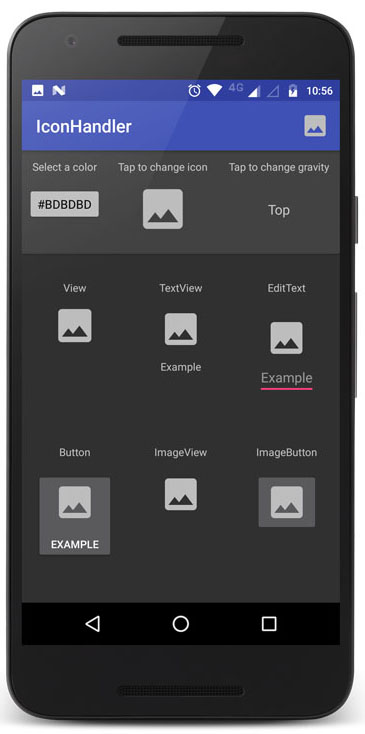
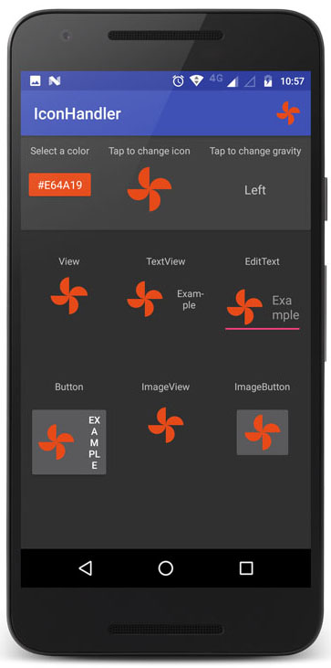

 <!-- Library Logo -->
 

 <!-- Buy me a cup of coffe -->
 <a href='https://ko-fi.com/A406JCM' style='margin:13px;' target='_blank' align="right"></a>
 <a href='https://play.google.com/store/apps/details?id=com.vansuita.iconhandler.sample&pcampaignid=MKT-Other-global-all-co-prtnr-py-PartBadge-Mar2515-1' target='_blank' align="right"></a>

# Icon Handler


 This is an [**Android**](https://developer.android.com) project. This library handle the drawable customization and position on View, EditText, ImageView, TextView, Button and etc. You can do a lot with a few lines of code, like change the icon color, alpha or even the size. This library has a lot more customization and features than is able to show here. Please check the sample app and feel free to help with a pull request.

<br/>

[](https://jitpack.io/#jrvansuita/IconHandler)
[](https://android-arsenal.com/details/1/4525) [](https://www.uplabs.com/posts/iconhandler) 

 

 [](https://appetize.io/embed/hz5ywza6nxqr2urz9tewb9er8c?device=nexus7&scale=50&autoplay=true&orientation=portrait&deviceColor=black) [](http://apk-dl.com/dl/com.vansuita.iconhandler.sample)
[](https://www.codacy.com/app/jrvansuita/IconHandler?utm_source=github.com&amp;utm_medium=referral&amp;utm_content=jrvansuita/IconHandler&amp;utm_campaign=Badge_Grade)
  <a target="_blank" href="https://developer.android.com/reference/android/os/Build.VERSION_CODES.html#GINGERBREAD"></a>


# Setup

#### Step #1. Add the JitPack repository to your build file:

```gradle
allprojects {
    repositories {
	...
	maven { url "https://jitpack.io" }
    }
}
```

#### Step #2. Add the dependency ([See latest release](https://jitpack.io/#jrvansuita/IconHandler)).

```groovy
dependencies {
       compile 'com.github.jrvansuita:IconHandler:+'
}
```

# Implamentation
```java
//Setting up a icon on background of a View.
Icon.put(yourView, R.mipmap.your_icon);

//Setting up a icon on the ImageView.
Icon.put(yourImageView, R.mipmap.your_icon);

//Setting up a icon on the left of the TextView. Also can use right(), top() and bottom() methods.
Icon.left(yourTextView, R.mipmap.your_icon);

//Setting up a icon on MenuItem
Icon.on(yourMenuItem).icon(R.mipmap.your_icon).put();

//Setting up a icon to the ImageView and converting it to blue.
Icon.top(yourTextView).gray(R.mipmap.your_icon).put();

//Setting up a icon to the ImageView and converting it to your custom color.
Icon.on(yourImageView).color(R.color.your_color).icon(R.mipmap.your_icon).put();

//Setting up a bitmap as a icon.
Icon.right(yourTextView).bitmap(yourBitmap).put();

//Setting up a icon on dynamic position
Icon.on(yourTextView).icon(R.mipmap.your_icon).position(Gravity.LEFT).put();

//You can merge the usage with colors transformations.
Icon.on(yourImageView).black(R.mipmap.your_icon).put();

//Setting up a icon to the ImageView and applying alpha. (0-255)
Icon.on(yourImageView).white(R.mipmap.your_icon).alpha(130).put();

//Will make the icon appears weak. Receiving focus will reveals the real color of icon.
Icon.focusable(yourEditText, R.mipmap.your_icon, Gravity.RIGHT);

//Just another edit text to lose the focus of the first.
Icon.focusable(yourEditText).position(Gravity.RIGHT).icon(R.mipmap.your_icon).put();

yourImageButton.setOnClickListener(new View.OnClickListener() {
    @Override
    public void onClick(View view) {
         //Clearing all icons of the View.
         Icon.clear(yourImageButton);
      }
    });
```

#
<a href="https://www.instagram.com/jnrvans/" target="_blank">
  
</a>
<a href="https://github.com/jrvansuita" target="_blank">
  
</a>
<a href="https://play.google.com/store/apps/dev?id=8002078663318221363" target="_blank">
  
</a>
<a href="mailto:vansuita.jr@gmail.com" target="_blank" >
  
</a>
